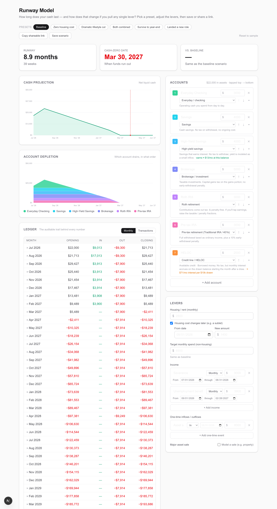

# Runway Model

A transition-stage financial runway calculator. It answers one question for
someone between incomes (layoff, sabbatical, going full-time on a project):
**how long does your cash last, and how does that change if you pull any single
lever?**

> **Live demo:** [runway.lizbuilds.ai](https://runway.lizbuilds.ai) · _(Phase 0 — pipeline live; the modeling app lands over Phases A–D.)_

This README is organized to the lizbuilds.ai "Builds" template and is filled in
as the build progresses.

---

## Problem

People in an income transition face a short-term, post-transition cash-flow
crunch: severance is running out, unemployment hasn't started, and several
accounts with different tax and access rules have to be drawn down in some
order. Long-term planning tools (Right Capital, eMoney, MoneyGuide Pro) and
general budgeting apps (Monarch, YNAB) don't model this window. Runway Model
fills that gap — it shows how long the money lasts and how each lever changes
the answer.

## Role / context

I'm Liz, a PM. This began as a personal decision tool right after my own income
transition — a single-file HTML artifact (V1) that I built and had reviewed by
my financial advisor, Chris Wiethe. V2 is the rebuild: a generic, deployed
product that ships with a fictional sample scenario, so it reads as a real tool
(and protects my privacy) rather than a personal spreadsheet.

## System / approach

- **V1 → V2 migration.** V1 was a Claude Cowork HTML artifact with six hardcoded
  levers, my personal numbers baked in, and cash treated as one monolithic pool.
  V2 is a Next.js app on Vercel with a generic, user-configurable account model
  and an audit-grade ledger. That migration — from throwaway artifact to
  deployed product — is part of the story, not just plumbing.
- **Pure engine at the core.** The simulation lives in a UI-free TypeScript
  module (`/lib/engine`): scenario in → projection + ledger out, zero React/DOM
  dependencies, fully unit-tested with Vitest. It's the audit-grade heart and
  the reusable core.
- **No backend.** State lives in the URL (a single compact `?s=` param, for
  sharing) and localStorage (saved scenarios + last session). A shared link
  fully reproduces a scenario on load.

**Simulation flow** (`lib/engine/simulate.ts`) — a deterministic month-by-month walk:

```
Scenario  ─►  for each month of the timeline:
(accounts,        1. accrue HYSA interest (into the account)
 levers,          2. accrue credit interest on prior-month drawn balances
 timeline)        3. apply manual draws
                  4. credit income + one-off inflows  ─┐
                  5. debit housing + living + one-off  ├─ all post to the
                     outflows + taxes due + interest   ┘  "operating" account
                  6. if operating < 0 → cascade the shortfall down the
                     depletion waterfall (assets, then credit lines),
                     scheduling tax/penalty as future-dated events
                  7. if still short → cash-zero (day-precise via proration)
                  8. snapshot per-account ledger + balances
          ─►  SimulationResult { runway, months[], projection[],
                                  accountTimelines[], transactions[],
                                  scheduledTaxes[] }
```

Account types (`checking · savings · hysa · brokerage · roth · pretax ·
credit_line · other`) drive default tax treatment and ongoing cost; all values
are user-editable, and "Other" is a no-implications escape hatch.

## Decisions & tradeoffs

- **Generic account model over hardcoded numbers.** V1 baked in my personal
  finances. V2 models any user's accounts with type-driven (editable) tax and
  cost behavior. Costs more upfront design; buys privacy, a real-product feel,
  and the eventual advisor/B2B story.
- **Pure engine, separated from the UI.** The simulation has zero React/DOM
  dependencies, so it is unit-tested directly (24 tests, ~99% line coverage)
  and reusable. The tests encode the exact truths the advisor review demanded —
  e.g. a $X/mo spend change moves cumulative outflow by *exactly* $X/mo.
- **Monthly time-step, not V1's daily loop.** Makes the audit ledger and the
  self-consistency guarantees exact; cash-zero still gets day precision via
  intra-month proration. Tradeoff: sub-monthly cash-flow timing is approximated.
- **Export-ready ledger shape.** Every month is stored as per-account rows
  (opening, categorized inflows/outflows, closing) plus a dated transaction
  list, so a later CSV/JSON export is a small add, not a refactor.

## Outcome & status

**Live and feature-complete through Phase D.** Built-in situation presets
(Baseline, Zero housing cost, Dramatic lifestyle cut, Both combined, Survive to
year-end — solved via binary search — and Landed a new role), Save-scenario to
localStorage, and shareable-URL state: the scenario serializes to a compact
`?s=` param on every change, so a refresh restores the current scenario and a
copied link reproduces it exactly in a fresh tab. Hydration priority is URL >
localStorage > sample, with an explicit "Reset to sample" for the clean demo.

Earlier phases: **C** — major-asset-sale lever (net proceeds, closing costs,
loan + tied-credit-line payoff, cap-gains tax to the following April, stopping
associated income / carrying cost), computed ongoing costs per account, the full
type → implications mapping with the "Other" escape hatch, and an auto-scaling
chart x-axis. **B** — the dashboard (hero metrics, SVG cash-projection chart
clamped at zero with a baseline overlay, stacked depletion visualization,
editable drag-reorderable account list, lever controls, audit ledger with a
transaction-level toggle). **A** — the pure engine + Vitest suite. **0** —
scaffold deployed to Vercel, iframe-embeddable by lizbuilds.ai.

**53 tests** across the engine, UI helpers, presets, chart window, and the
shareable-URL round-trip.

Before/after vs. V1: monolithic cash → per-account audit ledger; hardcoded
personal numbers → a generic, type-driven account model.

## Screenshots



## Live demo

[runway.lizbuilds.ai](https://runway.lizbuilds.ai)

---

## Tech

Next.js (App Router) · TypeScript · Tailwind CSS · Vitest · deployed on Vercel.
No backend, no database, no auth.

## Develop

```bash
npm install
npm run dev      # http://localhost:3000
npm run build    # production build
npm run test     # Vitest (engine suite) — added in Phase A
```

## Embedding

The app sets `Content-Security-Policy: frame-ancestors 'self' https://lizbuilds.ai
https://*.lizbuilds.ai` so it can be embedded in an iframe on lizbuilds.ai, with
an "Open full app ↗" fallback link.
